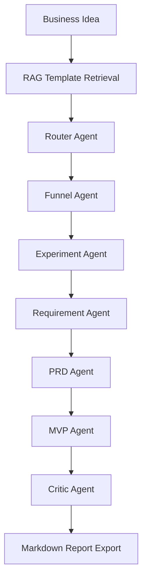

# GrowthPilot Agent

AI Growth Experiment Design Agent based on LangGraph

GrowthPilot Agent is a multi-agent workflow system that transforms vague business ideas into verifiable growth experiment plans, including conversion funnels, A/B tests, requirement pools, PRD drafts, event tracking plans, metric systems, and iteration suggestions.

GrowthPilot Agent 不是普通 PRD 生成器，而是一个面向消费 / 电商场景的 AI 增长实验设计 Agent。它将模糊商业想法拆解为可验证的增长实验链路，包括业务类型判断、转化漏斗、A/B 测试、需求池、PRD、埋点方案、指标体系和 badcase 迭代建议。

## Project Entry

Main project directory:

[intership_program/growthpilot-agent](./intership_program/growthpilot-agent)

Detailed README:

[Project README](./intership_program/growthpilot-agent/README.md)

## Value Proposition

普通 AI PRD 生成器主要解决“文档生成效率”问题。

GrowthPilot Agent 解决的是“商业想法到可验证增长实验之间的结构化落地问题”。

它不是只生成文档，而是生成一条完整链路：

`业务判断 -> 转化漏斗 -> 增长实验 -> A/B 测试 -> 需求池 -> PRD -> 埋点 -> 指标体系 -> Critic Review -> Iteration Log`

- 传统 PRD、需求池、A/B 测试、埋点和指标体系容易分散在不同文档里。
- GrowthPilot Agent 把这些内容放进同一条 Agent Workflow。
- 每个需求都绑定漏斗环节和影响指标，而不是只列功能点。
- 每个实验都要求包含实验组、对照组、成功标准和风险。
- Critic Agent 会前置发现 badcase，并输出下一轮迭代建议。

## Workflow



## Tech Stack

- Python
- Streamlit
- LangGraph
- DeepSeek API / OpenAI-compatible API
- TF-IDF RAG
- Prompt Engineering
- Markdown Report Export

## Core Features

- Business Type Classification
- User Persona Analysis
- Conversion Funnel Modeling
- Growth Experiment Design
- A/B Testing Plan Generation
- Requirement Pool Generation
- PRD Draft Generation
- MVP Feature Planning
- Event Tracking Plan
- Metric System Design
- Critic Agent Review
- Badcase Analysis
- Iteration Suggestions
- Markdown Report Export

## Why Not Just a PRD Generator?

| Dimension | Ordinary AI PRD Generator | GrowthPilot Agent |
| --- | --- | --- |
| Goal | Generate PRD documents | Generate verifiable growth experiment workflow |
| Output | Mainly documentation | Documents + experiments + metrics + tracking + review |
| Requirement Pool | Feature list | Features linked to funnel stage and metric |
| A/B Testing | Often separate or missing | Includes hypothesis, A/B group, metric, risk |
| Event Tracking | Often added later | Generated with metric system |
| Badcase Review | Manual review | Critic Agent review |
| Iteration | Experience-driven | Iteration Log driven by badcase analysis |

GrowthPilot Agent focuses on building a verifiable growth loop, not just generating product documents.

## Quick Start

Windows:

```bash
cd intership_program/growthpilot-agent
python -m venv .venv
.venv\Scripts\activate
pip install -r requirements.txt
streamlit run app.py
```

macOS / Linux:

```bash
cd intership_program/growthpilot-agent
python -m venv .venv
source .venv/bin/activate
pip install -r requirements.txt
streamlit run app.py
```

## Environment Variables

Create a `.env` file from `.env.example`.

DeepSeek example:

```env
OPENAI_API_KEY=your_deepseek_api_key
OPENAI_BASE_URL=https://api.deepseek.com
OPENAI_MODEL=deepseek-chat
```

This project supports OpenAI-compatible APIs, so it can work with DeepSeek, OpenAI, Qwen, and other compatible models.

## Demo Output Example

Example input:

```text
我想做一个校园二手交易平台
```

Example output:

```text
Business Type: Campus C2C second-hand marketplace
North Star Metric: Weekly successful campus transactions
Funnel: Exposure -> Product Publish -> Browse/Search -> Contact Seller -> Transaction
Experiment: Verified seller label A/B test
Core Metric: Contact initiation rate
Requirement Pool: P0 / P1 / P2 feature planning
PRD: MVP product requirement draft
Event Tracking: page_view, publish_submit, item_card_click, contact_click, mark_deal_click
Critic Finding: Front-end acquisition experiment is missing
Iteration Suggestion: Add referral-based acquisition experiment
```

## Interview Highlights

- This is not a PRD generator; it is a growth experiment workflow.
- LangGraph is used to orchestrate the multi-agent workflow.
- RAG is used to inject PRD, A/B testing, event tracking and metric templates.
- Critic Agent acts as a Reflection node for badcase analysis and iteration.
- The project links requirements, experiments, metrics, tracking and iteration into one workflow.
- It demonstrates product thinking, metric thinking and AI workflow engineering.

## Project Structure

```text
GrowthPilot-Agent-LangGraph-AI-
├── README.md
└── intership_program/
    └── growthpilot-agent/
        ├── app.py
        ├── agents/
        ├── workflow/
        ├── rag/
        ├── knowledge_base/
        ├── skills/
        ├── docs/
        ├── examples/
        ├── screenshots/
        └── README.md
```

## Future Work

- Add SQL-based experiment result analysis
- Expand RAG knowledge base by industry
- Add RAG evaluation metrics such as recall rate and hit rate
- Add Rewrite Agent for automatic solution revision
- Package RAG retrieval, SQL analysis and report export as MCP tools
- Add SQL-based experiment result analysis as an MCP tool
- Add RAG evaluation as an MCP tool
- Add Rewrite Agent as an MCP tool
- Deploy the Streamlit demo online

## Optional MCP Integration

GrowthPilot Agent provides an optional MCP server layer that exposes internal capabilities as reusable tools:

- `retrieve_growth_templates`
- `generate_growth_report`
- `export_growth_report`

MCP does not directly improve generation quality. It standardizes tool access so MCP-compatible clients can reuse GrowthPilot's RAG retrieval, LangGraph workflow, and Markdown report export capabilities.

This feature is experimental and not required to run the Streamlit demo.

## Project Scope

This is a job-seeking MVP project, not a production-grade system.

Current scope:

- Local Streamlit demo
- OpenAI-compatible LLM API
- Local Markdown knowledge base
- TF-IDF RAG
- Markdown report export
- Mock fallback when API key is missing

Not included in the MVP:

- Real production database
- Real user login system
- Real payment system
- Real crawler
- Fine-tuning
- Production-level MCP integration

## Author

Built by AEsir-Official as a summer internship portfolio project.
