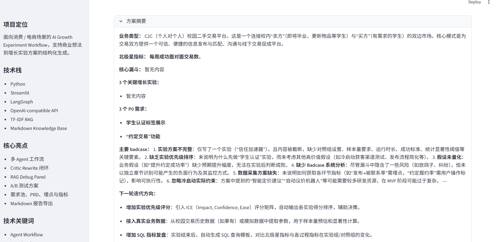
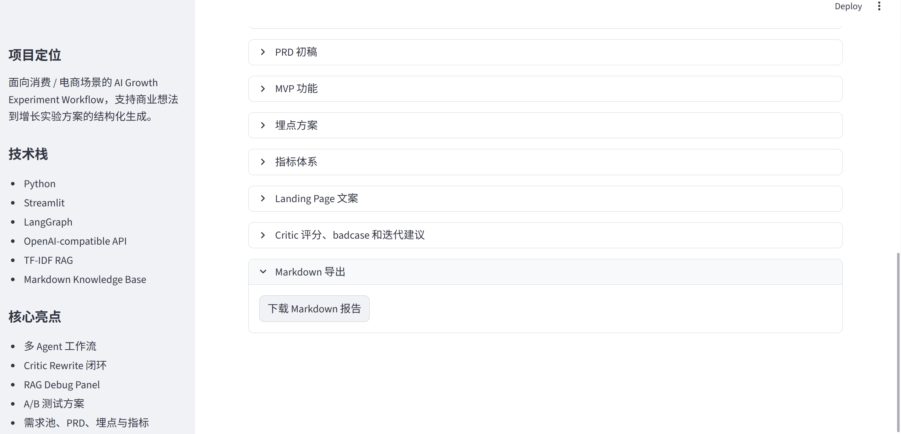

# GrowthPilot Agent

**AI Growth Experiment Design Agent based on LangGraph**  
**基于 LangGraph 的 AI 增长实验设计 Agent**

---

## English

### Overview

GrowthPilot Agent is an experimental AI growth workflow system for consumer and e-commerce scenarios. It transforms vague business ideas into structured growth experiment plans, including conversion funnels, A/B testing plans, requirement pools, PRD drafts, event tracking plans, metric systems, badcase analysis, and iteration suggestions.

## Demo Screenshots / 项目截图

### 1. Home Page / 首页


**EN:** The home page provides a business idea input box, example scenarios, workflow description, and key technical modules.  
**中文：** 首页包含商业想法输入框、示例场景、工作流说明和核心技术模块展示。

---

### 2. Generated Report Overview / 生成结果总览



**EN:** After entering a business idea, the system generates a structured growth experiment report, including funnel analysis, A/B testing, requirement pool, PRD draft, event tracking plan, metric system, and Critic Agent review.  
**中文：** 输入商业想法后，系统会生成结构化增长实验报告，包含转化漏斗、A/B 测试、需求池、PRD 初稿、埋点方案、指标体系和 Critic Agent 审查。

---

### 3. Markdown Report Export / Markdown 报告导出



**EN:** The generated result can be exported as a Markdown report for review, documentation, and further iteration.  
**中文：** 生成结果可以导出为 Markdown 报告，便于后续复盘、文档沉淀和迭代分析。

---

### Project Entry

Main project directory:

[intership_program/growthpilot-agent](./intership_program/growthpilot-agent)

Detailed project README:

[Project README](./intership_program/growthpilot-agent/README.md)

### Core Workflow

Business Idea  
→ RAG Template Retrieval  
→ Router Agent  
→ Funnel Agent  
→ Experiment Agent  
→ Requirement Agent  
→ PRD Agent  
→ MVP Agent  
→ Critic Agent  
→ Markdown Report Export

### Tech Stack

- Python
- Streamlit
- LangGraph
- DeepSeek API / OpenAI-compatible API
- TF-IDF RAG
- MCP Server
- Prompt Engineering
- Markdown Report Export

### Core Features

- Business Type Classification
- User Persona Analysis
- Conversion Funnel Modeling
- A/B Testing Plan Generation
- Requirement Pool Generation
- PRD Draft Generation
- Event Tracking Plan
- Metric System Design
- Critic Agent Review
- Badcase Analysis
- Iteration Suggestions
- Markdown Report Export
- Optional MCP Tool Integration

### Why GrowthPilot Agent

Ordinary document generators mainly focus on writing product documents. GrowthPilot Agent focuses on building a verifiable growth experiment loop.

It connects requirements, experiments, metrics, event tracking, risk review, and iteration planning into one workflow.

### Quick Start

Windows:

```bash
cd intership_program/growthpilot-agent
python -m venv .venv
.venv\Scripts\activate
pip install -r requirements.txt
streamlit run app.py
```

macOS / Linux:

```bash
cd intership_program/growthpilot-agent
python -m venv .venv
source .venv/bin/activate
pip install -r requirements.txt
streamlit run app.py
```

### Environment Variables

```env
OPENAI_API_KEY=your_deepseek_api_key
OPENAI_BASE_URL=https://api.deepseek.com
OPENAI_MODEL=deepseek-chat
```

This project supports OpenAI-compatible APIs, so it can work with DeepSeek, OpenAI, Qwen, and other compatible models.

### Optional MCP Integration

GrowthPilot Agent provides an optional MCP Server that exposes selected internal capabilities as tools:

- `retrieve_growth_templates`
- `generate_growth_report`
- `export_growth_report`

The MCP layer is optional and does not affect the Streamlit application.

## 中文

### 项目简介

GrowthPilot Agent 是一个面向消费 / 电商场景的 AI 增长实验设计系统。它可以将模糊商业想法拆解为结构化增长实验方案，覆盖转化漏斗、A/B 测试、需求池、PRD 初稿、埋点方案、指标体系、badcase 分析和迭代建议。

### 项目入口

主项目目录：

[intership_program/growthpilot-agent](./intership_program/growthpilot-agent)

详细项目说明：

[Project README](./intership_program/growthpilot-agent/README.md)

### 核心工作流

商业想法  
→ RAG 模板检索  
→ Router Agent  
→ Funnel Agent  
→ Experiment Agent  
→ Requirement Agent  
→ PRD Agent  
→ MVP Agent  
→ Critic Agent  
→ Markdown 报告导出

### 技术栈

- Python
- Streamlit
- LangGraph
- DeepSeek API / OpenAI-compatible API
- TF-IDF RAG
- MCP Server
- Prompt Engineering
- Markdown Report Export

### 核心功能

- 业务类型判断
- 用户画像分析
- 转化漏斗建模
- A/B 测试方案生成
- 需求池生成
- PRD 初稿生成
- 埋点方案生成
- 指标体系设计
- Critic Agent 审查
- Badcase 分析
- 迭代建议
- Markdown 报告导出
- Optional MCP 工具集成

### 项目价值

普通文档生成器主要解决“写文档”的问题。GrowthPilot Agent 关注的是“商业想法到可验证增长实验链路”的结构化落地。

它将需求、实验、指标、埋点、风险审查和迭代计划串联在同一条 Agent Workflow 中。

### 快速启动

Windows:

```bash
cd intership_program/growthpilot-agent
python -m venv .venv
.venv\Scripts\activate
pip install -r requirements.txt
streamlit run app.py
```

macOS / Linux:

```bash
cd intership_program/growthpilot-agent
python -m venv .venv
source .venv/bin/activate
pip install -r requirements.txt
streamlit run app.py
```

### 环境变量

```env
OPENAI_API_KEY=your_deepseek_api_key
OPENAI_BASE_URL=https://api.deepseek.com
OPENAI_MODEL=deepseek-chat
```

本项目支持 OpenAI-compatible API，因此可以接入 DeepSeek、OpenAI、Qwen 等兼容模型。

### Optional MCP Integration

GrowthPilot Agent 提供 optional MCP Server，将部分内部能力封装为外部可调用工具：

- `retrieve_growth_templates`
- `generate_growth_report`
- `export_growth_report`

MCP 层为可选扩展，不影响 Streamlit 主应用运行。

### Project Structure / 项目结构

```text
GrowthPilot-Agent-LangGraph-AI-
├── README.md
└── intership_program/
    └── growthpilot-agent/
        ├── app.py
        ├── agents/
        ├── workflow/
        ├── rag/
        ├── knowledge_base/
        ├── mcp_server/
        ├── skills/
        ├── examples/
        ├── docs/
        ├── screenshots/
        └── README.md
```

### Scope / 项目边界

This is an experimental MVP, not a production-grade system.

本项目是实验性 MVP，不是生产级系统。

Current scope:

- Local Streamlit application
- OpenAI-compatible LLM API
- Local Markdown knowledge base
- TF-IDF RAG
- LangGraph workflow
- Optional MCP Server
- Markdown report export

Not included:

- Production database
- User account system
- Payment system
- Real crawler
- Fine-tuning
- Production-level deployment

### Future Work / 后续方向

- Add SQL-based experiment result analysis
- Expand the RAG knowledge base by industry
- Add RAG evaluation metrics such as recall rate and hit rate
- Add Rewrite Agent for automatic solution revision
- Add real competitor data input
- Deploy the Streamlit demo online
