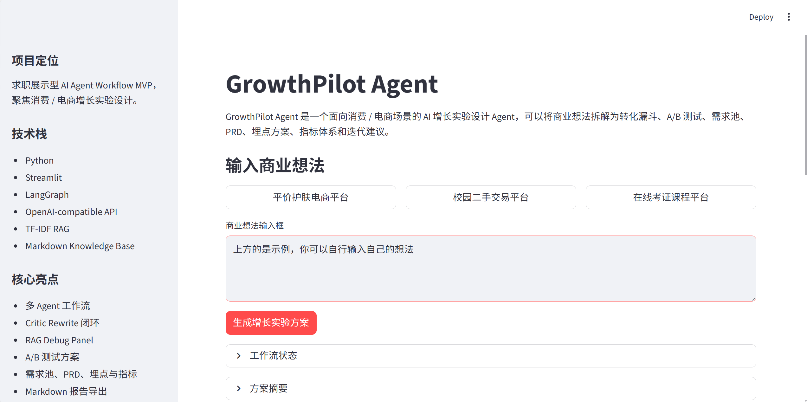
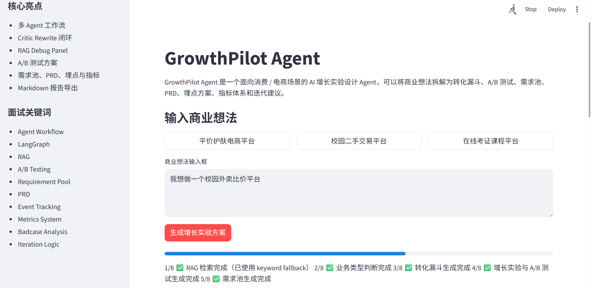
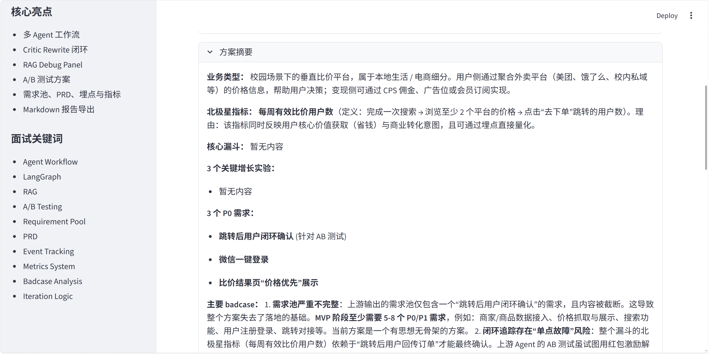
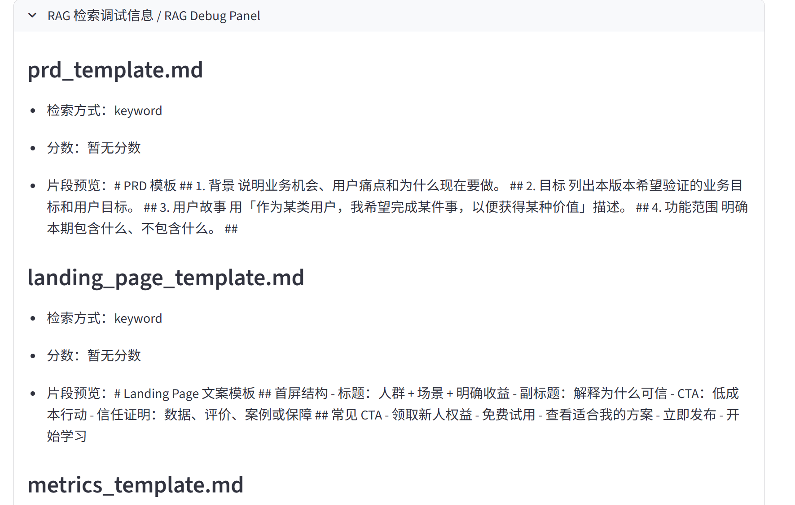
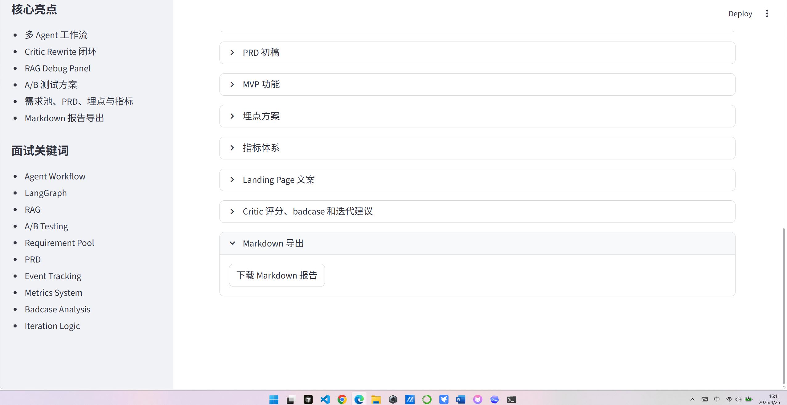
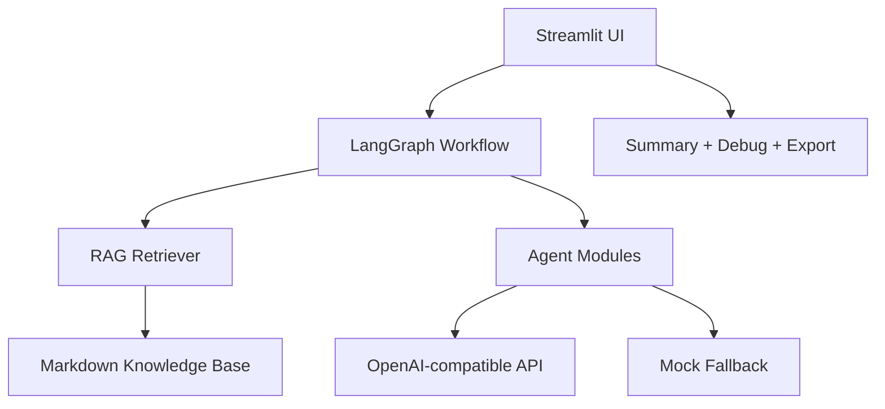

# GrowthPilot Agent

GrowthPilot Agent 是一个面向消费 / 电商场景的 AI 增长实验设计 Agent。

它不是普通 PRD 生成器。普通 PRD 生成器通常把想法扩写成产品文档，而 GrowthPilot Agent 会把一个商业想法拆解成可验证的增长实验 workflow：业务类型判断、目标用户画像、转化漏斗、增长实验、A/B 测试、需求池、PRD、MVP 功能、埋点方案、指标体系、Landing Page 文案，以及 Critic Agent 的 badcase 分析、修复方案和下一轮迭代建议。

项目定位是求职展示型 MVP：优先保证能本地运行、结构清晰、输出完整、方便 GitHub 展示和面试演示。

## Value Proposition / 项目价值

传统方案的问题：

- PRD、A/B 测试、埋点、指标和复盘分散在多个文档。
- 功能需求和业务指标容易脱节。
- AI PRD 生成器容易输出看起来完整但实际空泛的文档。
- badcase 依赖人工复盘，难以形成标准化迭代闭环。

GrowthPilot Agent 解决的问题：

- 将商业想法拆解为可验证增长实验。
- 用 LangGraph 编排多 Agent 工作流。
- 用 RAG 注入 PRD、A/B 测试、埋点、指标模板。
- 用 Critic Agent 做 Reflection，输出 badcase、修复建议和下一轮迭代建议。

和传统 PRD / 商业计划书生成器的不同：

- 不是只生成文档，而是生成业务验证链路。
- 每个需求绑定漏斗环节和指标。
- 每个实验包含实验组、对照组、成功标准和风险。
- 每个埋点服务于具体指标。
- Critic Agent 会检查方案是否可执行，并给出修订方向。

## Framework Positioning / 框架定位

- 本项目主要属于 LangGraph / LangChain Agent Workflow 方向。
- 使用 LangGraph 的 `StateGraph` 编排多个 Agent 节点。
- 本项目不是 Dify 项目，因为没有使用 Dify 的低代码画布；选择 Python + LangGraph 是为了展示代码实现和工作流编排能力。
- 本项目不是 LlamaIndex 项目，因为没有使用 LlamaIndex；但实现了轻量 RAG，用本地 Markdown 知识库 + TF-IDF 检索增强上下文。
- 当前没有真正接入 MCP。MCP 作为 Future Work，可将 RAG 检索、Markdown 导出、SQL 指标分析封装为 MCP tools。

## Skill-like Modular Design

- 本项目没有实现 ChatGPT 官方 Skills。
- 本项目采用 skill-like modular design，将增长分析能力拆成可复用模块。
- 当前模块包括：漏斗分析、A/B 测试设计、需求池生成、PRD 生成、埋点设计、指标体系设计、Critic Review。
- 这些 skill-like 模块对应 LangGraph 中的 Agent 节点，便于后续迁移成真正的 Skills 或 MCP tools。

对应目录：

```text
skills/
├── funnel_analysis.md
├── ab_test_design.md
├── requirement_pool.md
├── prd_generation.md
├── event_tracking.md
├── metrics_design.md
└── critic_review.md
```

## Screenshots / Demo Preview



首页输入区与项目定位展示，适合演示初始交互入口。



工作流阶段进度反馈，展示 LangGraph 执行过程和阶段完成状态。



方案摘要区，快速概览业务类型、关键实验、P0 需求和迭代方向。



RAG Debug Panel，展示命中文档、检索方式、分数和片段预览。



Markdown 报告导出结果，体现最终结构化交付和迭代闭环说明。

## 核心能力

- Agent Workflow：多个 Agent 分工完成增长方案设计。
- LangGraph DAG：用图结构组织 Router、Funnel、Experiment、Requirement、PRD、MVP、Critic。
- RAG：从本地 markdown 知识库检索业务模板，减少空泛输出。
- A/B Testing：输出实验组、对照组、核心指标、观察指标、成功标准和风险。
- Requirement Pool：把增长实验转成可排期、可验收的需求池。
- PRD：输出产品背景、目标用户、用户路径、功能需求、验收标准和风险边界。
- Event Tracking：输出 `event_name`、`trigger`、`properties`、`purpose`、`related_metric`。
- Metrics System：输出北极星指标、一级指标、过程指标和实验判断指标。
- Badcase Analysis：识别输出太空泛、实验不可执行、指标不匹配等问题。
- Iteration Logic：给出下一轮产品和 Agent 迭代建议。
- Markdown Export：一键导出完整增长实验报告。

## 适合面试讲的点

- 不只是内容生成，而是增长实验 workflow。
- 有 RAG，能把本地业务模板写入 Agent prompt，减少空泛输出。
- 有 A/B 测试和指标体系，能体现增长实验思维。
- 有需求池、PRD、埋点方案，能把实验转成产品交付物。
- 有 Critic Agent 做 badcase 和迭代建议，能体现自我评估闭环。
- 有 RAG Debug Panel，可以展示检索来源、分数和漏召回调试。
- 有 mock fallback，没有 API key 也能稳定演示。

## 技术栈

- Python
- Streamlit
- LangGraph
- OpenAI-compatible API
- OpenAI Python SDK
- TF-IDF RAG
- Prompt Engineering
- Markdown Knowledge Base

当前 MVP 不使用数据库、Docker、Next.js、复杂爬虫或真正的 MCP。

## 项目架构

```text
growthpilot-agent/
├── app.py
├── requirements.txt
├── README.md
├── .env.example
├── agents/
│   ├── router.py
│   ├── funnel_agent.py
│   ├── experiment_agent.py
│   ├── requirement_agent.py
│   ├── prd_agent.py
│   ├── mvp_agent.py
│   └── critic_agent.py
├── workflow/
│   └── graph.py
├── rag/
│   ├── retriever.py
│   └── vector_store.py
├── knowledge_base/
│   ├── ecommerce_funnel.md
│   ├── ab_test_template.md
│   ├── requirement_pool_template.md
│   ├── prd_template.md
│   ├── event_tracking_template.md
│   ├── metrics_template.md
│   ├── iteration_template.md
│   └── landing_page_template.md
├── utils/
│   ├── llm.py
│   ├── parser.py
│   ├── summarizer.py
│   └── exporter.py
├── skills/
├── examples/
├── docs/
└── screenshots/
```



## 工作流


## 如何启动

### 1. 创建虚拟环境

```bash
cd growthpilot-agent
python -m venv .venv
.venv\Scripts\activate
```

### 2. 安装依赖

```bash
pip install -r requirements.txt
```

### 3. 配置环境变量

复制 `.env.example` 为 `.env`：

```bash
copy .env.example .env
```

填写：

```bash
OPENAI_API_KEY=your_api_key_here
OPENAI_BASE_URL=
OPENAI_MODEL=gpt-4o-mini
```

说明：

- `OPENAI_API_KEY`：你的 API key。
- `OPENAI_BASE_URL`：可选。用于 OpenAI-compatible API，例如 DeepSeek 兼容接口；如果使用 OpenAI 官方接口，可以留空。
- `OPENAI_MODEL`：模型名，默认 `gpt-4o-mini`。

如果没有配置 API key，程序不会崩溃，会自动使用 mock fallback 输出。

### 4. 启动页面

```bash
streamlit run app.py
```

### 5. 语法检查

```bash
python -m compileall .
```

## Smoke Test / 快速验收

可以运行：

```bash
python scripts/smoke_test.py
```

用于检查：

- 工作流是否能跑通
- fallback 是否可用
- progress_callback 是否正常
- RAG Debug 是否返回
- Markdown 导出是否包含 Iteration Log

## 页面体验

当前页面包含：

- 示例 idea 快捷按钮
- 阶段进度反馈
- 方案摘要
- RAG Debug Panel
- 详细结构化结果
- Markdown 报告导出

## 示例输入输出

项目内置了三个完整示例，适合 GitHub 展示和面试讲解：

- [大学生平价护肤电商平台](examples/skincare_ecommerce.md)
- [校园二手交易平台](examples/campus_secondhand.md)
- [大学生在线考证课程平台](examples/online_course.md)

每个示例都包含业务类型判断、用户画像、转化漏斗、增长实验与 A/B 测试、需求池、PRD、MVP、埋点、指标、Landing Page、Critic、badcase 和迭代建议。

## Markdown 导出

生成方案后，页面底部会出现“下载 Markdown 报告”按钮。

导出文件名固定为：

```text
growthpilot_report.md
```

导出报告会包含用户输入、所有 Agent 输出、Critic 评分、RAG 检索来源、Iteration Log / 迭代闭环说明和下一轮迭代建议。如果某个字段为空，会显示“暂无内容”，不会报错。

## RAG 设计

`rag/retriever.py` 会读取 `knowledge_base/` 下所有 markdown 文件。

检索策略：

1. 优先使用 `scikit-learn` 的 `TfidfVectorizer` 和 `cosine_similarity`。
2. 如果 `scikit-learn` 不可用或 TF-IDF 检索失败，回退到本地关键词匹配。
3. 如果知识库为空或检索整体失败，返回默认增长分析模板。

RAG Debug Panel 会展示：

- 命中的文件
- 分数
- 检索方式
- 片段预览

## Badcase Analysis

| badcase | 现象 | 原因 | 修复方案 | 对应项目模块 |
| --- | --- | --- | --- | --- |
| 输出太空泛 | 只说“提升转化”“优化体验”，没有动作 | prompt 没要求绑定漏斗和指标 | 每条建议必须包含漏斗环节、具体动作、核心指标、验证方式 | `agents/*` |
| 实验不可执行 | 有实验方向，但没有实验组、对照组和成功标准 | 实验模板不完整 | Experiment Agent 强制输出实验组、对照组、指标、成功标准和风险 | `agents/experiment_agent.py` |
| 指标和漏斗环节不匹配 | 访问环节却用复购率判断 | 指标体系没有分层 | MVP Agent 输出北极星指标、一级指标、过程指标，并绑定漏斗环节 | `agents/mvp_agent.py` |
| PRD 缺少验收标准 | 功能写了，但不知道怎么判断完成 | PRD 只做描述，没有验收口径 | PRD Agent 必须包含验收标准和数据指标 | `agents/prd_agent.py` |
| 埋点只有事件名没有属性 | `event_name` 有了，但无法分析渠道、版本和用户行为 | 埋点字段设计不足 | 埋点必须包含 `trigger`、`properties`、`purpose`、`related_metric` | `agents/mvp_agent.py` |

## 为什么没有做微调

- 当前任务更偏结构化业务生成，而不是固定风格文本复写。
- prompt + RAG + workflow 的性价比更高：prompt 控制结构，RAG 提供业务模板，workflow 保证步骤稳定。
- 微调更适合有大量标注数据、稳定输出风格和长期重复任务的场景。
- 对求职展示型 MVP 来说，微调会增加数据准备和训练复杂度，但不一定提升核心展示价值。

## 项目边界

- 当前不是生产级系统。
- 没有接真实数据库。
- 没有真实爬虫。
- 没有微调模型。
- 没有真正接入 MCP。
- 没有生产级权限、监控、日志和部署系统。
- 重点是求职展示型 Agent Workflow MVP。

## SQL Future Work / 真实数据复盘方向

未来可以接入真实业务数据库，用 SQL 分析用户行为事件表、商品表、订单表和实验分组表。

示例数据表：

- `users`
- `events`
- `items` / `products`
- `orders`
- `experiments`

可计算指标：

- CTR
- 发帖转化率
- 商品详情页点击率
- 发起对话率
- 对话 -> 成交转化率
- 留存率
- 复购率

价值说明：

Agent 未来可以基于真实指标判断 A/B 测试是否成功，并自动生成下一轮迭代建议。

## 面试材料

- [简历项目描述](docs/resume_bullets.md)
- [面试讲解稿](docs/interview_script.md)
- [项目总结](docs/project_summary.md)

## Future Work

Additional MCP-related future work:

- Add SQL-based experiment result analysis as an MCP tool
- Add RAG evaluation as an MCP tool
- Add Rewrite Agent as an MCP tool

## Optional MCP Integration

GrowthPilot Agent provides an optional MCP server layer that exposes internal capabilities as reusable tools:

- `retrieve_growth_templates`
- `generate_growth_report`
- `export_growth_report`

MCP does not directly improve generation quality. It standardizes tool access so MCP-compatible clients can reuse GrowthPilot's RAG retrieval, LangGraph workflow, and Markdown report export capabilities.

This feature is experimental and not required to run the Streamlit demo.

- 接入真实业务数据库，用 SQL 分析转化漏斗。
- 接入真实搜索 API 做竞品调研。
- 接入真实埋点数据做自动复盘，形成“生成方案 -> 执行实验 -> 数据复盘 -> 自动迭代”的闭环。
- 接入 MCP，让 Agent 能访问更多外部工具。
- 增加实验优先级评分，让 Agent 根据影响面、置信度和开发成本排序。
