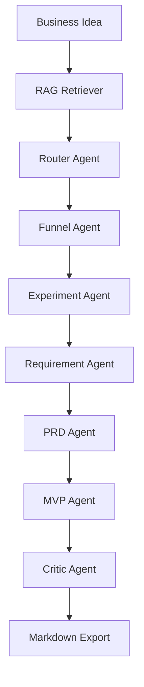

# GrowthPilot Agent

GrowthPilot Agent is an AI growth experiment design system for consumer and e-commerce scenarios.

它不是普通 PRD 生成器，而是一个把商业想法拆解成增长验证链路的 AI Growth Experiment Workflow：业务类型判断、用户画像、转化漏斗、增长实验、A/B 测试、需求池、PRD、埋点方案、指标体系、Landing Page 文案，以及基于 Critic Agent 的 badcase 分析和迭代建议。

## Overview

Many business ideas start as a short sentence, but validating them usually requires multiple disconnected artifacts: funnels, requirements, experiments, PRDs, event tracking, metrics, and review notes.

GrowthPilot Agent organizes those artifacts into one workflow:

`Business Classification -> Funnel -> Growth Experiments -> A/B Tests -> Requirement Pool -> PRD -> Event Tracking -> Metrics -> Critic Review -> Iteration Log`

## Core Capabilities

- Business type classification
- Target user / persona analysis
- Conversion funnel modeling
- Growth experiment design
- A/B testing plan generation
- Requirement pool generation
- PRD draft generation
- MVP feature planning
- Event tracking plan generation
- Metrics system design
- Landing Page copy generation
- Critic Agent review and iteration suggestions
- Markdown report export

## Technical Stack

- Python
- Streamlit
- LangGraph
- OpenAI-compatible API
- OpenAI Python SDK
- Local Markdown knowledge base
- TF-IDF RAG
- Prompt engineering

## Architecture



## Project Structure

```text
growthpilot-agent/
├── app.py
├── requirements.txt
├── requirements-mcp.txt
├── README.md
├── .env.example
├── agents/
├── workflow/
├── rag/
├── knowledge_base/
├── skills/
├── examples/
├── docs/
├── screenshots/
└── mcp_server/
```

## Quick Start

### 1. Create a virtual environment

Windows:

```bash
python -m venv .venv
.venv\Scripts\activate
```

macOS / Linux:

```bash
python -m venv .venv
source .venv/bin/activate
```

### 2. Install dependencies

```bash
pip install -r requirements.txt
```

### 3. Configure environment variables

Copy `.env.example` to `.env`:

```bash
copy .env.example .env
```

Example:

```env
OPENAI_API_KEY=your_api_key_here
OPENAI_BASE_URL=
OPENAI_MODEL=gpt-4o-mini
```

DeepSeek example:

```env
OPENAI_API_KEY=your_deepseek_api_key
OPENAI_BASE_URL=https://api.deepseek.com
OPENAI_MODEL=deepseek-chat
```

If no API key is configured, the project falls back to deterministic mock outputs so the full workflow remains runnable.

### 4. Start the Streamlit app

```bash
streamlit run app.py
```

## Smoke Tests

General workflow smoke test:

```bash
python scripts/smoke_test.py
```

This verifies:

- the workflow can run end to end
- fallback still works
- progress callback still works
- RAG debug information is returned
- markdown export includes the iteration log

Optional MCP smoke test:

```bash
python scripts/test_mcp_tools.py
```

This verifies:

- the optional MCP server can start
- `tools/list` can discover all three tools
- `retrieve_growth_templates` returns local template content
- `generate_growth_report` still works through fallback when no API key is available

## Examples

The project includes complete example outputs:

- [skincare_ecommerce.md](./examples/skincare_ecommerce.md)
- [campus_secondhand.md](./examples/campus_secondhand.md)
- [online_course.md](./examples/online_course.md)

## RAG Design

`rag/retriever.py` loads local markdown files from `knowledge_base/` and retrieves relevant context.

Retrieval strategy:

1. prefer `TfidfVectorizer + cosine_similarity`
2. fall back to keyword matching if TF-IDF is unavailable
3. fall back to a default growth analysis template if retrieval fails

The UI also exposes a `RAG Debug Panel` to show:

- matched source files
- retrieval method
- scores when available
- preview snippets

## Markdown Export

After generation, the app can export:

```text
growthpilot_report.md
```

The exported report includes:

- structured agent outputs
- critic review
- iteration log
- RAG retrieval sources

## Optional MCP Integration

GrowthPilot Agent provides an optional MCP server layer that exposes internal capabilities as reusable tools:

- `retrieve_growth_templates`
- `generate_growth_report`
- `export_growth_report`

MCP does not directly improve generation quality. It standardizes tool access so MCP-compatible clients can reuse GrowthPilot's RAG retrieval, LangGraph workflow, and Markdown report export capabilities.

This feature is experimental and not required to run the Streamlit demo.

See:

- [mcp_server/README.md](./mcp_server/README.md)
- [mcp_server/LICENSE_NOTES.md](./mcp_server/LICENSE_NOTES.md)

## Documentation

- [project_summary.md](./docs/project_summary.md)

## Product Scope

This is an experimental MVP, not a production-grade system.

Current scope:

- local Streamlit demo
- OpenAI-compatible LLM API
- local Markdown knowledge base
- TF-IDF RAG
- markdown report export
- mock fallback when API key is missing

Not included in the MVP:

- real production database
- real user login system
- real payment system
- real crawler
- fine-tuning
- production-level MCP integration

## Future Work

- add SQL-based experiment result analysis
- expand the RAG knowledge base by scenario
- add RAG evaluation metrics such as recall rate and hit rate
- add rewrite / revision logic for automatic plan refinement
- add SQL-based experiment result analysis as an MCP tool
- add RAG evaluation as an MCP tool
- add Rewrite Agent as an MCP tool

